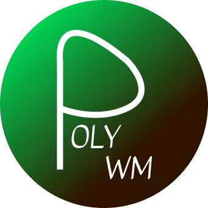

  

<h1 align="center">polyWM</h1>

  Performance; minimalism.

> [!TIP]
> This WM focuses on performance and minimalism for low-level developers. It is intended to be used by users who are able to debug issues on their own. It is intentionally stripped down to work on low end systems.

> [!CAUTION]
> Due to the nature of X11, compiling versions from unknown sources (i.e. not from GitHub) may result in serious system compromise.

---
### More Info

- To prevent clutter and general misuse, polyWM intentionally only allows for two tiles per workspace. If violated, the new window gets pushed out and spawns at the top left of the screen. It will re-tile whenever possible.
- The whole WM is considered experimental. Use at your own risk.
- Uses `dmenu` by default. Change it through `polywm.c` if desired.
- Uses `alacritty` by default. Change it through `polywm.c`.
- Changes will only take effect after the WM is recompiled.

### Get Started

- Compile polyWM by using the Makefile.
- Run `startx` after setting up `.xinitrc` including the executable binary from your TTY.
- Works best on Arch Linux. Other distributions have not been tested.
- Hold `Mod4` (Windows key) and:
  - `ENTER` - opens the terminal (alacritty)
  - `P` - exits polyWM; you can remove this if you wish
  - `Q` - kills a window
  - `D` - dmenu
  - `J/K` - backward/foward workspace movement
  - more keybinds can be found in your `config.h`.

### Prerequisites
- dmenu
- X11
- Alacritty

---

If you are new to Linux, setting up DEs and/or following documentation, do **_not_** use this WM. If you do not understand the contents of this README, you are advised not to use this project.
