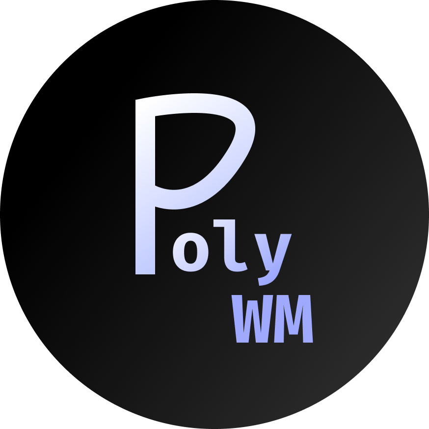

<p align="center">
  

</p>

<h1 align="center">polyWM</h1>

<p align="center">
  Simple; capable.
</p>

> [!IMPORTANT]
> Legacy polyWM can be found [here](https://github.com/Polymorqhism/polyWM-legacy).

---
### More Info
- Unlike polyWM-legacy, polyWM no longer focuses purely on performance. The goal of the rewrite is to ensure that the code is maintainable and complete with proper file structure.
- polyWM uses linked lists to store windows on a workspace. Previously, it used a static array which led to many issues.
- As of current, the project is incomplete.


### License
- Uses the GPL-3.0 License. See LICENSE for details.
- polyWM comes with no warranty.

### Get Started
```
git clone https://github.com/Polymorqhism/polyWM
cd polyWM
make
```
- This will give you the polyWM binary in `build/`, you can use it with your greeter or directly start into it using your `.xinitrc` from TTY.
- Requires X11 & Linux.

### About This Project
- Intended to be used as a daily driver.
- Allows 2 tiles per workspace. Further tiles become floating windows.

### FAQ
- ...

## Metrics
| Metric | Value |
|--------|-------|
| Memory | ...  |
| Binary Size   | ... |


## Credits & Resources
- During the development of polyWM, the following resources were used. This is a non-exhaustive list, but will contain necessary information to replicate the project by oneself:
  - polyWM-legacy - https://github.com/Polymorqhism/polyWM-legacy/
  - The Xlib Manual - https://tronche.com/gui/x/xlib/